<table width="100%">
  <tr>
    <td width="60%">
      <h2>⭐ Hi, I'm Regina!</h2>
      
A Computer Science major, currently in the process of learning and experiencing :)

      <h2>💻 Tech Stack</h2>
      
      
      
      
       
      
      
      
      
       
      
      
      
       
      
      
      
      
       
      
      
      
      
      
      
    </td>
    <td width="40%" align="center">
<pre>
  ⠀⠀⠀⠀⠀⠀⠀⠀⠀⠀⠀
</pre>
    </td>
  </tr>
</table>

## 👩🏻‍💻 About Me
🌐 **Currently Exploring:** Cybersecurity, UX/UI, Data Science  
🎱 **Side Quests:** Creative Media, Sudoku, Badminton, Writing, Content Creation  
🪼 **In Short:** Engineering code-driven solutions at the intersection of logic, design, and production  
❔ **Username:** Skiz = Stray Kids, Studies = I like to study 😻

   

